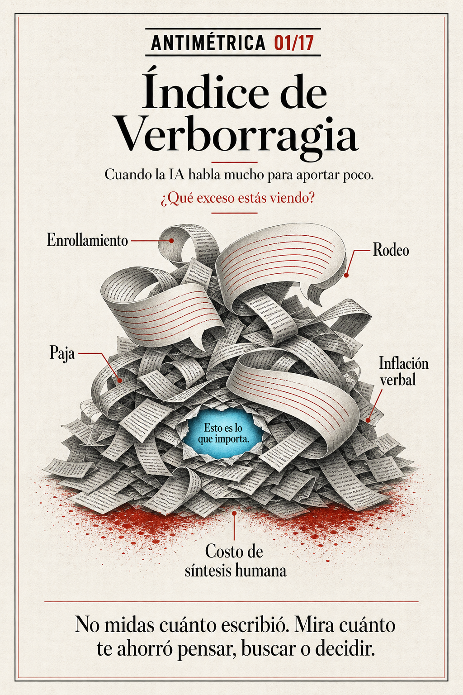

# Antimétricas

**Un vocabulario para reconocer los fallos cotidianos de la inteligencia artificial en el trabajo.**



Las grandes tecnológicas miden velocidad, parámetros, benchmarks, ventanas de contexto y coste por token. Las Antimétricas miran otra cosa: la fricción que aparece cuando una respuesta parece competente, pero no produce un resultado útil.

No son indicadores científicos ni fórmulas para un dashboard. Son nombres memorables para detectar comportamientos observables, dirigir mejor los asistentes de IA y evitar que un fallo pequeño termine convertido en retrabajo, una mala decisión o un accidente profesional.

> La métrica pregunta cuánto produce. La antimétrica pregunta cuánto de eso realmente sirve.

La colección y el publicador automático fueron creados por **Rodrigo Arteaga Trigo / Webnart**.

## Las 17 Antimétricas

Cada carpeta contiene la publicación (`post.md`), su pieza gráfica (`image.png`) y un comentario manual opcional (`comment.md`).

| Nº | Antimétrica | Qué permite observar |
|---:|---|---|
| 01 | [Índice de Verborragia](content/antimetricas/01-indice-de-verborragia/post.md) | Cuánto texto añade la IA sin aumentar el valor de la respuesta. |
| 02 | [Tasa de Delegación Inversa](content/antimetricas/02-tasa-de-delegacion-inversa/post.md) | Cuánto trabajo devuelve al usuario después de haberlo recibido como tarea. |
| 03 | [Índice de Volatilidad de Criterio](content/antimetricas/03-indice-de-volatilidad-de-criterio/post.md) | Cuánto cambia el criterio entre respuestas equivalentes. |
| 04 | [Índice de Abandono Operativo](content/antimetricas/04-indice-de-abandono-operativo/post.md) | Cuántas tareas acepta pero deja sin terminar. |
| 05 | [Brecha Promesa–Entrega](content/antimetricas/05-brecha-promesa-entrega/post.md) | La distancia entre lo que promete hacer y lo que realmente entrega. |
| 06 | [Índice de Disculpa Vacía](content/antimetricas/06-indice-de-disculpa-vacia/post.md) | Cuántas veces reconoce un error sin repararlo. |
| 07 | [Índice de Obediencia Inversa](content/antimetricas/07-indice-de-obediencia-inversa/post.md) | La tendencia a comenzar precisamente por lo que se pidió evitar. |
| 08 | [Índice de Verificación Fingida](content/antimetricas/08-indice-de-verificacion-fingida/post.md) | Cuántas comprobaciones afirma haber hecho sin poder demostrarlas. |
| 09 | [Latencia de Valor](content/antimetricas/09-latencia-de-valor/post.md) | Cuánto tarda una interacción en producir algo verdaderamente útil. |
| 10 | [Peaje de Supervisión](content/antimetricas/10-peaje-de-supervision/post.md) | Cuánta vigilancia humana exige una tarea supuestamente delegada. |
| 11 | [Índice de Retrabajo](content/antimetricas/11-indice-de-retrabajo/post.md) | Cuánto trabajo adicional requiere convertir la salida en un entregable. |
| 12 | [Índice de Hipercautela](content/antimetricas/12-indice-de-hipercautela/post.md) | Cuánto valor pierde una respuesta por exceso de prudencia. |
| 13 | [Índice de Temeridad](content/antimetricas/13-indice-de-temeridad/post.md) | Cuánta seguridad muestra cuando debería expresar límites o incertidumbre. |
| 14 | [Índice de Amnesia Contextual](content/antimetricas/14-indice-de-amnesia-contextual/post.md) | Cuánto contexto disponible deja de utilizar al decidir o responder. |
| 15 | [Peaje de Clarificación](content/antimetricas/15-peaje-de-clarificacion/post.md) | Cuántas preguntas traslada al usuario cuando podría proponer y avanzar. |
| 16 | [Índice de Repetición Estéril](content/antimetricas/16-indice-de-repeticion-esteril/post.md) | Cuántas reformulaciones repiten el mismo defecto sin corregirlo. |
| 17 | [Índice de Desvarío](content/antimetricas/17-indice-de-desvario/post.md) | La aparición de resultados extraños cuando todo parecía estar bien encaminado. |

La formulación completa del concepto está en [Antimétricas: lo que de verdad deberíamos aprender a mirar en la IA](content/master-essay.md).

## Por qué existe este repositorio

El proyecto tiene dos capas:

1. **La colección editorial:** 17 textos y piezas gráficas que ayudan a profesionales, managers y dueños de negocio a reconocer fallos frecuentes de los asistentes de IA.
2. **El experimento técnico:** un publicador diario que distribuye la serie en LinkedIn mediante su API oficial, manteniendo un registro local para evitar saltos y duplicados.

La hipótesis central es sencilla: la siguiente etapa de la adopción de IA no dependerá únicamente de quién tenga acceso al mejor modelo, sino de quién tenga mejores criterios para dirigirlo, auditarlo y corregirlo.

## Cómo funciona el publicador

El workflow de GitHub Actions:

1. Se activa diariamente alrededor de las 10:20, zona `Europe/Paris`.
2. Selecciona la primera pieza aprobada que todavía no figura como publicada.
3. Valida `post.md` e `image.png`.
4. Sube la imagen y espera a que LinkedIn pueda procesarla.
5. Publica imagen y texto mediante la API oficial.
6. Guarda el URN y el estado `published` antes del siguiente ciclo.

Las ejecuciones retrasadas son aceptadas entre las 10:00 y las 12:59. Los archivos `comment.md` se conservan como referencia manual: **el robot no publica comentarios**.

## Límites de seguridad

- Solo utiliza la API oficial de LinkedIn y OAuth del titular.
- No automatiza navegadores ni realiza scraping.
- No envía mensajes, solicitudes de conexión, reacciones o comentarios.
- No interactúa con publicaciones de terceros.
- Los tokens se guardan exclusivamente como GitHub Actions Secrets.
- `.env` está excluido del repositorio.
- Un registro ambiguo o no resuelto bloquea la campaña para evitar duplicados.

Los nombres de los secrets aparecen en el workflow, pero sus valores no forman parte del código:

- `LINKEDIN_AUTOMATION_APPROVED`
- `LINKEDIN_ACCESS_TOKEN`
- `LINKEDIN_PERSON_URN`
- `LINKEDIN_TOKEN_EXPIRES_AT`
- `LINKEDIN_API_VERSION`

## Estructura

```text
content/
  master-essay.md
  antimetricas/
    01-indice-de-verborragia/
      post.md
      image.png
      comment.md
    ...
config/campaign.json
src/
state/publication-log.json
.github/workflows/publish-daily.yml
```

## Desarrollo local

Requiere Node.js 20 o posterior.

```powershell
npm run check
npm run dry-run
```

El dry run muestra la siguiente pieza y sus archivos sin llamar a LinkedIn.

## Autoría y derechos

Concepto, textos, imágenes y código: **Copyright © 2026 Rodrigo Arteaga Trigo — Webnart. Todos los derechos reservados.**

Este repositorio es público para consulta, documentación y transparencia del experimento. Su publicación no concede permiso para copiar, modificar, redistribuir, entrenar sistemas con el contenido ni explotar comercialmente los materiales. Consulta [LICENSE](LICENSE) antes de reutilizar cualquier parte.
